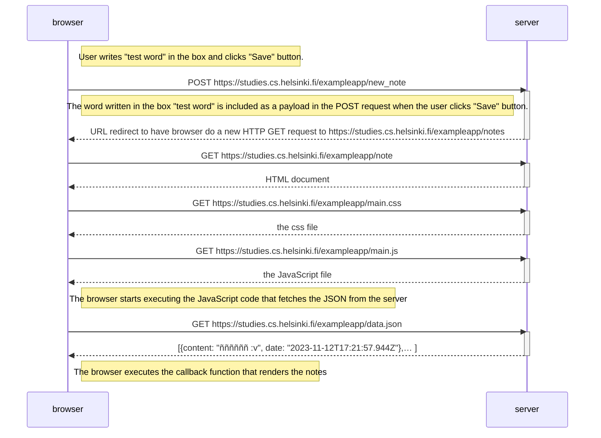

# Mermaid markdown

```mermaid
sequenceDiagram
    participant browser
    participant server

    Note right of browser: User writes "test word" in the box and clicks "Save" button.

    browser->>server: POST https://studies.cs.helsinki.fi/exampleapp/new_note
    activate server

    Note right of browser: The word written in the box "test word" is included as a payload in the POST request when the user clicks "Save" button.

    server-->>browser: URL redirect to have browser do a new HTTP GET request to https://studies.cs.helsinki.fi/exampleapp/notes
    deactivate server

    browser->>server: GET https://studies.cs.helsinki.fi/exampleapp/note
    activate server
    server-->>browser: HTML document
    deactivate server

    browser->>server: GET https://studies.cs.helsinki.fi/exampleapp/main.css
    activate server
    server-->>browser: the css file
    deactivate server

    browser->>server: GET https://studies.cs.helsinki.fi/exampleapp/main.js
    activate server
    server-->>browser: the JavaScript file
    deactivate server

    Note right of browser: The browser starts executing the JavaScript code that fetches the JSON from the server

    browser->>server: GET https://studies.cs.helsinki.fi/exampleapp/data.json
    activate server
    server-->>browser: [{content: "ññññññ :v", date: "2023-11-12T17:21:57.944Z"},… ]
    deactivate server

    Note right of browser: The browser executes the callback function that renders the notes
```
